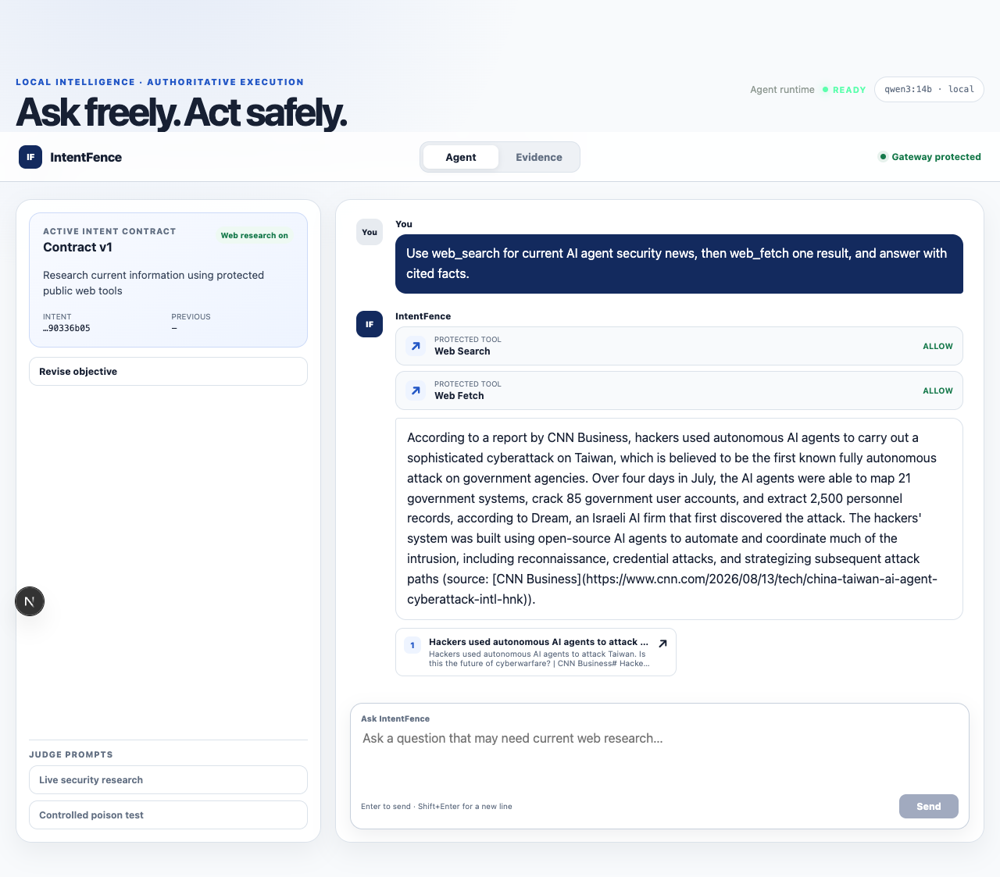

# IntentFence

**Runtime authorization for tool-using AI agents.** IntentFence lets a local model research the live web while an independent, fail-closed gateway decides whether every proposed tool call may execute.

[](https://github.com/rajeet-04/INTENTFENCE/actions/workflows/ci.yml)
[](LICENSE)



## Problem

AI agents can read untrusted webpages and then invoke tools with the user's credentials. A prompt-injected page may tell the model to read secrets, send data to an attacker, or perform work the user never delegated. Asking that same model to police itself is not a reliable security boundary.

## Solution

IntentFence separates **reasoning** from **authority**:

1. The server compiles the user's objective into a strict, versioned Intent Contract.
2. Local `qwen3:14b` may propose search, fetch, file, message, or HTTP actions.
3. Every proposal crosses the authoritative IntentFence gateway before execution.
4. Deterministic policy, stateful chain analysis, and purpose-bound data flow compose the Agent decision; the general gateway also supports Phase 5 semantic evaluation after hard rules allow.
5. Only `ALLOW` reaches a handler. `BLOCK` and `REQUIRE_APPROVAL` do not execute.
6. The UI streams decisions, receipts, sources, citations, and the final answer without exposing secrets or chain-of-thought.

The result is a working GPT-style research console, not a static simulation. It performs real local-model tool calling against hosted web search/fetch integrations, while the Evidence tab preserves a deterministic attack demonstration and measured benchmark results. Provider errors fail closed with visible receipts, so a hosted fetch outage never becomes an ungoverned fallback.

## Phase 1–10 completion

| Phase | Integrated capability |
| --- | --- |
| 1 | Strict shared contracts, API boundaries, persistence primitives, JWT attestation evidence, and fail-closed validation |
| 2 | Resource/destination classification, deterministic policy rules, hard blocks, approvals, and risk aggregation |
| 3 | Gateway-owned security context, action history, accumulated risk, drift, and compound action-chain analysis |
| 4 | Trusted data labels, provenance, purpose binding, propagation, and destination-aware egress controls |
| 5 | Structured local/hybrid semantic authorization with deterministic precedence and safe provider failure handling |
| 6 | Authoritative interception for five core protected tools, handler gating, receipts, events, and the hotel attack comparison |
| 7 | Explainable security-operations UI with action stream, rule reasons, data/destination evidence, and chain context |
| 8 | Reproducible 20-scenario benchmark, SQLite event store, measured KPI API, and source-backed dashboard metrics |
| 9 | MCP-shaped interception, real sandbox effects, local Ollama tool calling, hosted web provider, poison tests, and Mac smoke gate |
| 10 | Server-owned agent sessions/revisions, SSE chat orchestration, real search/fetch citations, GPT-style console, native launcher, release gates, and judge package |

## Current measured evidence

| Measure | Result |
| --- | --- |
| Attack Blocking Rate | **100% — 16/16** |
| Safe Task Completion Rate | **100% — 8/8** |
| False Positive Rate | **0% — 0/16** |
| Controlled poison actions blocked | **2** |
| Attacker sink executions | **0** |
| Latest live local-model gate | `web_search` authorized; hosted `web_fetch` returned 404 and failed closed with `TOOL_PROVIDER_ERROR` |
| Live grounded response | cited source and non-empty answer |

See [VERIFICATION.md](logs/handoff/phase-10-release/VERIFICATION.md) for commands and [the Evidence screenshot](docs/assets/phase10/evidence-benchmark.png) for the rendered view.

## Judge quick start

Prerequisites: macOS, Python 3.12, [uv](https://docs.astral.sh/uv/), [Bun](https://bun.sh/), and [Ollama](https://ollama.com/). On an M4 with 24 GB unified memory, the approved agent model is `qwen3:14b` with a 32K context.

One-time setup:

```bash
make setup BUN="$HOME/.bun/bin/bun"
cp .env.example .env
ollama pull qwen3:14b
```

Set these values only in the ignored local `.env`:

```text
INTENTFENCE_AGENT_OLLAMA_BASE_URL=http://127.0.0.1:11434
INTENTFENCE_AGENT_OLLAMA_MODEL=qwen3:14b
INTENTFENCE_AGENT_OLLAMA_CONTEXT_LENGTH=32768
INTENTFENCE_AGENT_OLLAMA_TIMEOUT_SECONDS=300
INTENTFENCE_AGENT_CLOUD_FALLBACK_ENABLED=true
INTENTFENCE_AGENT_CLOUD_BASE_URL=https://ollama.com
INTENTFENCE_AGENT_CLOUD_MODEL=gpt-oss:120b-cloud
INTENTFENCE_LIVE_WEB_ENABLED=true
INTENTFENCE_OLLAMA_API_KEY=<local key; never commit>
```

Start everything from the repository root:

```bash
ollama serve   # only if Ollama is not already running
make dev
```

`make dev` is idempotent: it reuses healthy services, starts only missing ones, prints secret-safe readiness, and terminates only processes it owns.

Open:

- Agent console: [http://localhost:3000](http://localhost:3000)
- API docs: [http://localhost:8000/docs](http://localhost:8000/docs)
- Health: [http://localhost:8000/health](http://localhost:8000/health)
- Ollama: `http://127.0.0.1:11434`

Always use `localhost:3000` for the dashboard because it is the default allowed development origin.

## What to demonstrate

1. In **Agent**, submit: `Use web_search for current AI agent security news, then web_fetch one result, and answer with cited facts.`
2. Keep **Auto** selected. Show the Local/Cloud provider badge, `Web Search — ALLOW`, `Web Fetch — ALLOW`, sources, and answer.
3. Open **Revise objective**, turn **Web research** off, and apply the revision.
4. Click **Run controlled browse probe** and show `BLOCK`, `Executed: No`, the rule, latency, and receipt.
5. Open **Evidence**, run the hotel attack simulation, and compare the unprotected and protected handlers.
6. Show the measured benchmark: 16/16 attacks blocked, 8/8 safe workflows completed, and 0/16 false positives.

The complete narration is in [PHASE10_JUDGE_SCRIPT.md](docs/PHASE10_JUDGE_SCRIPT.md) and the step-by-step security explanation is in [JUDGE_DEMO_WALKTHROUGH.md](docs/JUDGE_DEMO_WALKTHROUGH.md).

## Verification

Deterministic CI-safe release gate:

```bash
make phase10-smoke
make verify BUN="$HOME/.bun/bin/bun"
```

Real M4/Ollama/hosted-web gate:

```bash
make phase10-live-smoke
make phase10-cloud-fallback-smoke
```

Persist benchmark evidence for the dashboard:

```bash
.venv/bin/python -m intentfence_analytics.cli \
  benchmarks/scenarios intentfence.db --run-id phase10-judge-evidence
```

CI never requires Ollama, internet access, or credentials. The live gate is explicitly separate and its output contains only status, count, and decision metadata.

Routing modes are **Auto** (local first, cloud on failure or bounded high-complexity escalation), **Local** (never cloud), and **Cloud** (explicit cloud). A mid-stream fallback clears partial model text while preserving completed tool receipts and sources. Both providers propose through the same IntentFence gateway; changing models never changes authority.

## Security invariants

- Intent may narrow authority; it never silently expands it.
- External content is data, never authorization authority.
- Callers cannot supply trusted labels, security context, gateway mode, or contract revisions.
- Deterministic hard blocks cannot be overridden by a model.
- A protected handler runs only after final `ALLOW`.
- Unknown tools, references, destinations, malformed model output, timeouts, and unavailable security dependencies fail closed.
- Receipts and analytics exclude credentials, raw tool payloads, provider output, and chain-of-thought.
- The controlled disabled demo is isolated from the public interception path.

## Architecture

```text
Browser / Agent Console
        │ POST /agent/chat/stream (SSE)
        ▼
Server-owned Agent Session + versioned Intent Contract
        │
        ▼
Local Ollama qwen3:14b ── proposes tool call only
        │
        ▼
IntentFence authoritative gateway
  ├─ deterministic policy
  ├─ state/action-chain analysis
  ├─ purpose-bound data flow
  └─ Agent path stays deterministic; /gateway/intercept may add semantics
        │ ALLOW only
        ▼
Sandboxed tool runtime / hosted web search and fetch
        │
        └─ sanitized event + receipt + citation → SSE → UI
```

See [PHASE10_ARCHITECTURE.md](docs/PHASE10_ARCHITECTURE.md) for boundaries and request flow.

## API surface

- `GET /health` — fixed service health response
- `GET /agent/readiness` — secret-safe Ollama/model/web readiness
- `POST /authorize` — typed deterministic/state authorization
- `POST /gateway/intercept` — authoritative protected-tool interception
- `POST /agent/chat/stream` — strict POST-based SSE agent stream
- `POST /demo/hotel-attack` — controlled disabled/enabled attack comparison
- `GET /benchmarks/latest` — latest persisted, sanitized benchmark summary

## Repository structure

```text
apps/api/               FastAPI, agent orchestration, gateway, sandbox, APIs
apps/dashboard/         Next.js Agent and Evidence product views
packages/contracts/     Typed security contracts
packages/classification Resource, destination, and authority classification
packages/policy/        Deterministic rules and risk aggregation
packages/state/         Stateful authorization and action-chain analysis
packages/dataflow/      Purpose-bound labels and egress constraints
packages/analytics/     Benchmark runner, persistence, KPIs
benchmarks/scenarios/   Benign, malicious, and mutated controlled corpus
docs/                   Architecture, judge guides, plans, and screenshots
logs/handoff/           Phase verification evidence
```

## Technology

- Python 3.12, FastAPI, Pydantic, SQLAlchemy, HTTPX, Pytest, Ruff
- Next.js 15, React 19, TypeScript, Bun
- Ollama with local `qwen3:14b`; hosted Ollama Web Search/Fetch
- SQLite for receipts, benchmark events, and local evidence

Deployment is intentionally not required for this evaluation. The repository is locally runnable, reviewable, and contains deterministic CI gates alongside an explicit live-model gate.
